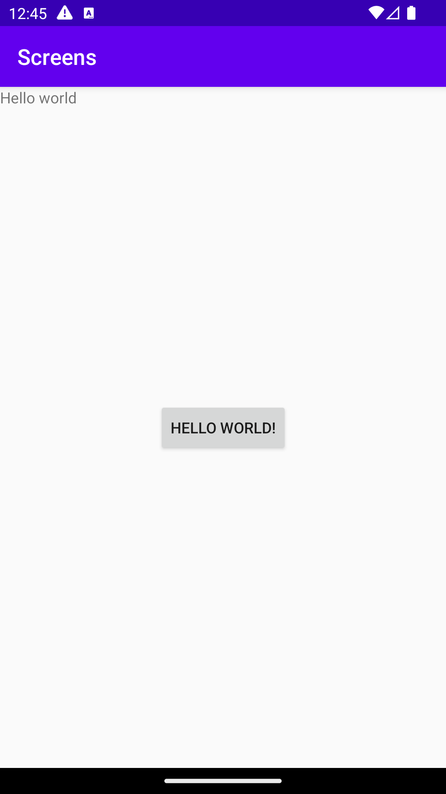

# Rapport

**Skriv din rapport här!**

Man började med att lägga till en knapp på första skämren som är 
"ButtonActivity". Uppgiften var att denna knapp skulle starta den 
andra aktiviteten när den första aktiviteten klickas på. Man var tvungen
att skicka data mellan skärmarna också genom att använda sig av Intent bundle. 
För att detta skulle fungera var man tvungen att använda sig av t.ex 
TextView och Button. 


Förklara kod:
super.onCreate(savedInstanceState) anropar den överordnade 
onCreate()-metoden för att säkerställa att den ursprungliga funktionaliteten 
utförs korrekt. 
setContentView(R.layout.activity_main) ställer in aktivitetens 
layout till att vara definierad i layoutfilen R.layout.activity_main. Detta 
innebär att användargränssnittet för aktiviteten kommer att visas baserat på 
denna layout. 
b = findViewById(R.id.button) hittar en knapp med id "button" i aktivitetens layout
och tilldelar referensen till en variabel b. 
b.setOnClickListener(new View.OnClickListener() { ... }) sätter en lyssnare på
knappen b som kommer att lyssna på klickhändelser. När knappen klickas på kommer 
den kod som finns inuti lyssnaren att köras.
Log.d("==>", "We clicked on Tomten!") skapar en loggmeddelande när knappen klickas 
på. Loggmeddelandet kommer att visas i Logcat-fönstret i Android Studio för att 
underlätta felsökning och spårning.
setContentView(R.layout.activity_button2) ändrar aktivitetens layout till att vara 
definierad i layoutfilen R.layout.activity_button2. 
Detta innebär att användargränssnittet för aktiviteten kommer att uppdateras och 
visas baserat på denna nya layout.


```
 protected void onCreate(Bundle savedInstanceState) {
        super.onCreate(savedInstanceState);
        setContentView(R.layout.activity_main);
        b = findViewById(R.id.button);

        b.setOnClickListener(new View.OnClickListener() {
            @Override
            public void onClick(View View) {

                Log.d("==>","We clicked on Tomten!");
                setContentView(R.layout.activity_button2);

                Intent intent = new Intent(MainActivity.this, ButtonActivity2.class);
                intent.putExtra("name", "Hello world"); // Optional
                //intent.putExtra("number", 1); // Optional
                startActivity(intent);
                
    }
}
```

Bilder:




För och nackdelar: 

Fördelar:

nackdelar:

